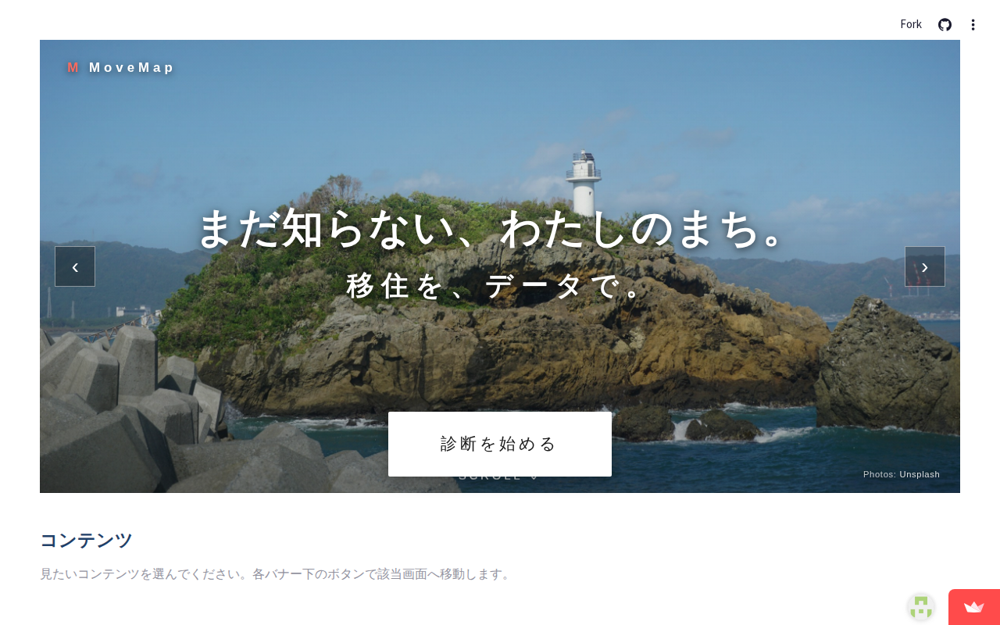

# MoveMap 🗾

**全国 47 都道府県 × 9 指標 × 3/5/10 年後 AI 予測の地方移住検討ツール。**

[](https://movemap.streamlit.app/)
[](.github/workflows)
[](outputs/decisions/DEC-016.md)
[](outputs/)

## 🌐 触ってみる:[https://movemap.streamlit.app/](https://movemap.streamlit.app/)



「物価が安く治安が良い県は?」「5 年後に住みよさが伸びそうな県は?」を、**公的統計の数値だけ**で答えるツール。風景写真をめくりながら、47 候補を 9 観点で同時に比較できます。

> ⚠️ **個人制作のポートフォリオ作品**(DEC-016 mode C)です。投資・不動産取引・移住の助言ではありません。最終判断はご自身で。

---

## 👀 採用担当・技術評価者の方へ

最短経路で本プロダクトの「設計力」「実装力」「運用力」を確認できる導線:

| 観点 | 推奨ドキュメント | 何が見えるか |
|---|---|---|
| **触ってみる** | [movemap.streamlit.app](https://movemap.streamlit.app/) | UI / UX / 機能網羅性 |
| **設計の通し方** | [outputs/](outputs/) — `00_problem.md` 〜 `99_review.md` | 課題定義から振り返りまで Phase 0-8 全成果物 |
| **意思決定の質** | [outputs/decisions/](outputs/decisions/) — 18 件の DEC ログ | なぜその設計を選んだか・選ばなかったかの全履歴 |
| **不変条件の運用** | [outputs/baseline.md](outputs/baseline.md) — 18 個の INV | DB制約 / アプリ層 / E2E で何を守らせているか |
| **AI 駆動開発の流儀** | [docs/learning/07_ai_dev_playbook.md](docs/learning/07_ai_dev_playbook.md) | twin-build フロー汎用化、つまずき TOP10 |
| **計測駆動運用** | [outputs/seo/](outputs/seo/) | 仮説 → GA4 イベント → 14日後振り返りループ |

---

## 💡 主な機能

| 機能 | 内容 |
|------|------|
| 🗾 **47 都道府県マップ** | 9 指標で全国を一望できる Plotly ヒートマップ。指標切替・年次切替対応 |
| 📊 **9 指標** | 物価 / 地価 / 賃料 / 出生数 / 空気質 / 災害リスク / 交通アクセス / 治安 / 人口流入 |
| 🔮 **AI 予測** | 主要 4 指標について **ARIMA + Prophet** で 3 / 5 / 10 年後を推計 |
| 🎯 **適合度診断** | 優先したい / 避けたい要素から、おすすめ 5 県を提示 |
| ⚖️ **2 県比較** | 気になる 2 県を 9 指標で並べて違いを可視化 |
| 📋 **モデル根拠** | R² / MAE / 学習日時を UI で透明化 |
| 📅 **月次自動更新** | GitHub Actions cron で 6 つの公的データソースを自動取込 |
| 🛡️ **不変条件強制** | INV-BIZ × 8 + INV-DATA × 8 + INV-EXT × 3 + INV-IDEM × 2(計 21 件) |

---

## ⚙️ 技術スタック

| カテゴリ | 採用 |
|---|---|
| 言語 | Python 3.11 |
| UI | Streamlit + Plotly choropleth + components.html(iframe ヒーロー) |
| DB | DuckDB(組み込み、append-only 強制 / `HistoryProtectedConnection`) |
| HTTP | httpx + truststore(社内 SSL 自動)+ tenacity(リトライ) |
| ETL | pandas |
| 予測 | statsmodels(ARIMA / SARIMA) + Prophet |
| スケジューラ | GitHub Actions cron(月初 02:00 JST) |
| パッケージ管理 | uv |
| テスト | pytest + streamlit.testing (243 cases pass) |
| Lint / Type | ruff + mypy |
| 計測 | Google Analytics 4 (opt-in Cookie 同意済) |
| 死活監視 | Playwright (Chromium) で自動ウェイク + UptimeRobot |

---

## 🏗 アーキテクチャ(VSA / Vertical Slice Architecture)

```
                     ┌──────────────────────────┐
                     │   Streamlit UI           │  app/main.py
                     │   - home / map / ranking │  + features/map_view/usecases/
                     │   - diagnosis / detail   │
                     │   - compare / model      │
                     │   - terms / privacy /    │
                     │     contact (?view=...)  │
                     └────────────┬─────────────┘
                                  │ data_provider.py (DB → dummy fallback)
                                  ▼
                     ┌──────────────────────────┐
                     │  DuckDB (組み込み)        │  data/movemap.duckdb
                     │  10 tables + 21 INV       │  - 履歴 append-only 強制
                     └────────────┬─────────────┘
                                  ▲
                                  │ run_batch.py (月次 cron)
              ┌───────────────────┴──────────────────────────┐
              │   ETL + 予測パイプライン                       │
              │   fetch → normalize → upsert + append →       │
              │   retrain → evaluate → predict → fallback     │
              └───────────────────┬──────────────────────────┘
                                  │
                                  ▼
                     ┌──────────────────────────┐
                     │  6 公的データソース        │  e-Stat / MLIT地価 / reinfolib
                     │                          │  そらまめくん / ハザード / 交通
                     └──────────────────────────┘
```

詳細: [outputs/05_architecture.md](outputs/05_architecture.md) / [outputs/06_system_design/](outputs/06_system_design/)

---

## 🚀 クイックスタート(ローカル 5 分)

```sh
# 1. 環境セットアップ(uv 必須)
python -m pip install uv
python -m uv sync --extra dev

# 2. DB 初期化 + デモ用合成履歴投入(API キー不要)
python -m uv run python scripts/seed.py --with-synthetic-history

# 3. 日本地図 GeoJSON 取得(初回のみ)
python -m uv run python scripts/fetch_geojson.py

# 4. アプリ起動 → http://localhost:8501
python -m uv run streamlit run app/main.py
```

これでダミーモデルの予測値が表示されます(🟡 ダミー表示)。
**本物データを使う**には reinfolib / e-Stat の API キーを `.env` に設定し、`run_batch.py` を実行(🔵 DB 実データに切替)。

詳細は [STARTUP.md](STARTUP.md) を参照。

---

## 📊 動作モード

| モード | データ取得 | 表示 | 用途 |
|---|---|---|---|
| **デモ** (API キーなし) | dummy.py の合成データ | 🟡 ダミー | UI 動作確認 |
| **合成履歴投入後** (`seed.py --with-synthetic-history`) | historical_values は実値 | 現在値は 🟡 / 予測は 🔵 | モデル動作確認 |
| **本番** (API キー + `run_batch.py`) | 6 公的データソース | すべて 🔵 DB 実データ | 公開運用 |

---

## 🛡 不変条件(21 件、`outputs/baseline.md` で正典化)

| カテゴリ | 件数 | 例 |
|---|---|---|
| INV-BIZ(業務ルール) | 8 | INV-BIZ-005: MAP 表示時に免責バナー常時表示 / INV-BIZ-008: 法務リンク導線 |
| INV-DATA(データ整合性) | 8 | INV-DATA-007: `historical_values` 物理 append-only(`HistoryProtectedConnection`) |
| INV-EXT(外部連携) | 3 | INV-EXT-001: 外部 API 失敗時は前回値保持 |
| INV-IDEM(冪等性) | 2 | INV-IDEM-001: 月次バッチが同月内再実行で同等結果 |

E2E + 単体テスト + DB CHECK 制約 + 静的検査で多重防御。

---

## 🔄 計測駆動運用(2026-06 〜)

**「公開して終わり」ではなく「計測 → 学習 → 改善」のループ**を回しています:

1. **VPC**(バリュープロポジションキャンバス)で 2 セグメントを言語化 → [outputs/value_proposition_canvas.md](outputs/value_proposition_canvas.md)
2. **SEO 36 施策** を ICE スコア順に整理 → [outputs/seo/01_action_list.md](outputs/seo/01_action_list.md)
3. **数値入り仮説 5 件** を立て、Brier score で予測キャリブレーション → [outputs/seo/02_hypotheses.md](outputs/seo/02_hypotheses.md)
4. **GA4 カスタムイベント**(horizon 切替 / 指標切替 / 県選択)で実測
5. **T+14 振り返り** で当たり外れを記録 → 次の打ち手へ

---

## 📚 ドキュメント目次

### Phase 成果物(設計の通し)
| Phase | ドキュメント |
|---|---|
| 0 課題定義 | [outputs/00_problem.md](outputs/00_problem.md) |
| 1 要求仕様 | [outputs/01_requirements.md](outputs/01_requirements.md) |
| 2 業務構造 | [outputs/02_business_structure.md](outputs/02_business_structure.md) |
| 3 業務フロー | [outputs/03_business_flow.md](outputs/03_business_flow.md) |
| 4 システム要件 | [outputs/04_system_requirements.md](outputs/04_system_requirements.md) |
| 5 アーキテクチャ | [outputs/05_architecture.md](outputs/05_architecture.md) |
| 6 システム設計 | [outputs/06_system_design/](outputs/06_system_design/) |
| 7 実装 | `app/` `scripts/` `seeds/` `tests/` `.github/` |
| 8 最終レビュー | [outputs/99_review.md](outputs/99_review.md) |
| - 業務不変条件 | [outputs/baseline.md](outputs/baseline.md) |

### 学習向け
| ドキュメント | 内容 |
|---|---|
| [docs/learning/01_executive_summary.md](docs/learning/01_executive_summary.md) | **5 分で全体を語る**サマリー |
| [docs/learning/02_self_quiz.md](docs/learning/02_self_quiz.md) | 39 問の自己テスト(初/中/上 + AX セールス) |
| [docs/learning/03_architecture.md](docs/learning/03_architecture.md) | Mermaid 図 + 詳細解説 |
| [docs/learning/04_pitch_deck_outline.md](docs/learning/04_pitch_deck_outline.md) | 7 スライドピッチデッキ案 |
| [docs/learning/07_ai_dev_playbook.md](docs/learning/07_ai_dev_playbook.md) | AI 駆動開発プレイブック |

---

## 📡 データソース

| ソース | 取得指標 | ライセンス |
|---|---|---|
| [e-Stat](https://www.e-stat.go.jp/) | 物価指数・出生数・治安・人口流入 | 政府標準利用規約 2.0 |
| [国土交通省 地価公示](https://www.land.mlit.go.jp/landPrice_/) | 地価 | 政府標準利用規約 2.0 |
| [国土交通省 reinfolib](https://www.reinfolib.mlit.go.jp/) | 賃料相場 | 政府標準利用規約 2.0 |
| [環境省 そらまめくん](https://soramame.env.go.jp/) | 空気質(PM2.5) | 政府標準利用規約 2.0 |
| [国土地理院 ハザードマップ](https://disaportal.gsi.go.jp/) | 災害リスク | 政府標準利用規約 2.0 |
| [国土交通省 交通インフラ](https://www.mlit.go.jp/sogoseisaku/transport/) | 交通アクセス | 政府標準利用規約 2.0 |

各データの出典・最終更新日はアプリ内で常時表示。

---

## ⚖️ ライセンス・運営者

- **コード**: MIT
- **データ**: 各データソースのライセンスに従う
- **画像**: Unsplash License(個別画像近くにクレジット表記)
- **運営者**: MoveMap 開発者(個人制作のポートフォリオ作品)
- **問い合わせ**: [サイト内 ?view=contact](https://movemap.streamlit.app/?view=contact) または GitHub Issue(任意)

## 🙏 クレジット

- [dataofjapan/land](https://github.com/dataofjapan/land) — 都道府県境界 GeoJSON
- [Unsplash](https://unsplash.com/) — 47 県の風景写真
- twin-build フローによる設計駆動開発(Phase 0-8 を一貫トレース)
