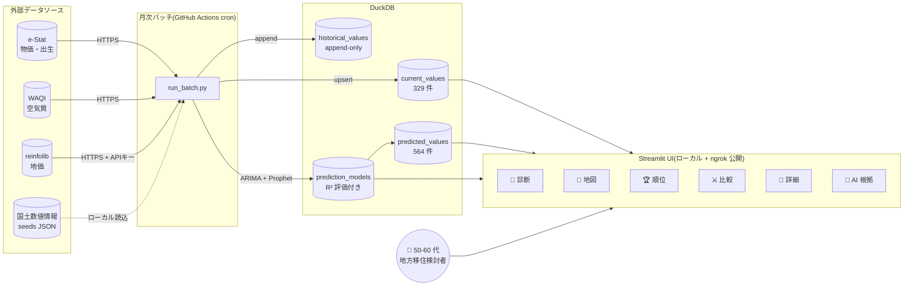
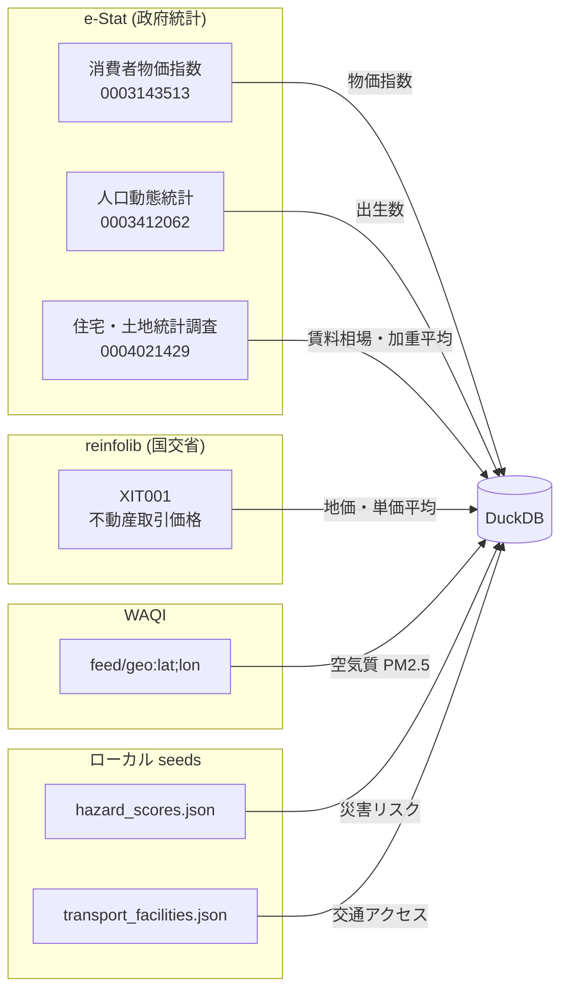
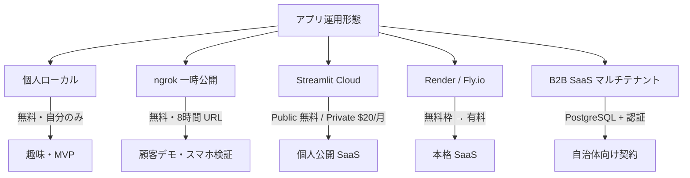

# 🏗️ MoveMap アーキテクチャ図と説明

> プロジェクトの構造を **図 + 文章** で理解するためのドキュメント。
> 顧客 / チームメンバーへの初回説明、開発者の onboarding に使えます。

---

## 1. システム全体図(上空から見る)



### この図のポイント

- **外部 API は月次バッチでのみ呼ぶ**(ユーザーアクセス毎に呼ばない = 安定性 + API 制限回避)
- **DB は読み取り中心**(UI は SELECT のみ、書込みはバッチだけ)
- **6 タブそれぞれ独立した Usecase**(VSA で分離、変更影響を最小化)
- **AI 予測モデルは別テーブル**(R² 評価値も保存 → モデル根拠タブで透明化)

---

## 2. データフロー詳細


### 主な不変条件(INV)で守られていること

| INV | 守られる性質 |
|---|---|
| INV-BIZ-001 | 47 都道府県 × 7 指標が常に DB に存在 |
| INV-BIZ-003 | R² < 0.6 の予測は `no_prediction` |
| INV-BIZ-005 | UI は必ず免責バナーを表示 |
| INV-DATA-007 | `historical_values` は append-only(UPDATE/DELETE 禁止) |
| INV-EXT-001 | 外部 API 失敗時は前回値保持 |
| INV-IDEM-001 | 月内に複数回実行しても結果が同じ |

---

## 3. ディレクトリ構造(VSA)

```
MoveMap/
├── app/
│   ├── main.py                          # Streamlit エントリポイント
│   ├── domain/                          # フレームワーク非依存の dataclass 集
│   │   ├── prefecture.py / indicator.py / values.py / prediction.py / batch.py / data_source.py
│   ├── features/
│   │   ├── map_view/                    # 🗾 地図/順位/詳細/診断/比較タブ
│   │   │   ├── usecases/
│   │   │   │   ├── show_map.py
│   │   │   │   ├── show_ranking.py
│   │   │   │   ├── show_comparison.py
│   │   │   │   ├── show_diagnosis.py
│   │   │   │   ├── show_prefecture_detail.py
│   │   │   │   ├── show_model_detail.py
│   │   │   │   ├── switch_indicator.py / switch_horizon.py
│   │   │   ├── components/
│   │   │   │   ├── heatmap.py           # Plotly Choropleth
│   │   │   │   ├── status_panel.py
│   │   │   ├── data_provider.py         # DB → dummy フォールバック
│   │   │   ├── ranking.py               # 偏差値 + 加重平均
│   │   │   ├── regions.py               # 地方マッピング + 主要都市
│   │   │   ├── dummy.py                 # 決定的ダミー値生成
│   │   ├── data_pipeline/               # 月次バッチ / モデル / 外部 API
│   │   │   ├── usecases/                # fetch / normalize / upsert / append / train / evaluate / predict / fallback / log / run_batch
│   │   │   ├── sources/                 # estat / mlit_land_price / mlit_rent_index / env_soramame / gsi_hazard / mlit_transport
│   │   │   ├── models/                  # arima.py / prophet_model.py
│   │   ├── compliance/                  # 免責バナー / 出典表示
│   │   │   ├── disclaimer.py / show_data_sources.py
│   ├── shared/                          # 横断ユーティリティ
│   │   ├── config.py                    # 環境変数ロード(dotenv)
│   │   ├── db.py                        # DuckDB 接続 + DDL + HistoryProtectedConnection
│   │   ├── http_client.py               # httpx + tenacity + truststore
│   │   ├── logger.py                    # RotatingFileHandler(5MB × 5 世代)
│   │   ├── geo.py                       # 緯度経度 / haversine 距離
│   │   ├── ui_theme.py                  # グローバル CSS + ヒーロー + モバイル対応
│
├── seeds/                               # 初期データ
│   ├── prefectures.csv / indicators.csv / data_sources.csv
│   ├── hazard_scores.json / transport_facilities.json
│   ├── japan_prefectures.geojson
│
├── data/
│   └── movemap.duckdb                   # DB 本体(.gitignore)
│   └── snapshots/YYYYMM/                # 月次スナップショット
│
├── scripts/
│   ├── seed.py / run_batch.py / fetch_geojson.py
│   ├── health_check.py / snapshot.py / restore.py / demo.py
│   ├── ngrok_tunnel.py                  # スマホ公開用
│
├── tests/                               # pytest(199 件 + slow E2E 5 件)
│   ├── unit/                            # 単体テスト(parser / formatter / 計算)
│   ├── integration/                     # DB を使う統合テスト
│   ├── smoke/                           # streamlit.testing.AppTest
│
├── outputs/                             # twin-build フェーズ設計書
│   ├── 00_problem.md 〜 99_review.md / baseline.md / DEPLOYMENT.md / OPERATIONS.md
│
├── docs/learning/                       # 本ドキュメント群
│   ├── 01_executive_summary.md
│   ├── 02_self_quiz.md
│   ├── 03_architecture.md  ← いまここ
│
├── .streamlit/config.toml               # テーマ設定(light + primary #1f4068)
├── .env                                 # API キー(.gitignore)
├── .env.example
├── pyproject.toml / uv.lock
├── README.md / STARTUP.md / CHANGELOG.md
```

### VSA の利点(レイヤアーキとの対比)

| | レイヤアーキ | VSA(本プロジェクト) |
|---|---|---|
| 探す時 | `controllers/show_map.py` から `services/...` を追う | `features/map_view/usecases/show_map.py` 1 つで完結 |
| 機能削除 | レイヤ横断で関連ファイルを消す | フォルダごと消せる |
| AI 駆動開発 | 影響範囲が広く生成困難 | 1 Usecase 単位で AI 生成しやすい |
| トレードオフ | 共通ロジックの DRY 化が容易 | 同じロジックが複数 feature に散らばる可能性 |

---

## 4. 主要コンポーネント早見表

| コンポーネント | 役割 | 主要ファイル |
|---|---|---|
| **UI(Streamlit)** | 6 タブのインターフェース | `app/main.py`, `features/map_view/usecases/*.py` |
| **データ取得(ETL)** | 外部 API → 正規化 → DB | `features/data_pipeline/sources/*.py`, `usecases/fetch_external_data.py`, `normalize_data.py` |
| **DB(DuckDB)** | 永続化、SQL クエリ | `app/shared/db.py`, `data/movemap.duckdb` |
| **予測モデル** | ARIMA + Prophet | `features/data_pipeline/models/*.py`, `usecases/retrain_models.py` |
| **可視化** | choropleth, radar, microchart | `components/heatmap.py`, `usecases/show_comparison.py` |
| **診断** | 5 問質問 → 重み算出 → 推薦 3 県 | `usecases/show_diagnosis.py` |
| **テスト** | unit / integration / smoke | `tests/{unit,integration,smoke}/` |
| **運用** | health_check / snapshot / restore | `scripts/health_check.py`, `snapshot.py`, `restore.py` |

---

## 5. 「住みやすさスコア」の計算ロジック(中核アルゴリズム)

```mermaid
flowchart TD
    A[7 指標 × 47 都道府県の生値] --> B{各指標の偏差値化}
    B -->|Z = (x - μ) / σ| C[偏差値 = 50 + 10·Z·direction]
    C -->|direction=+1 高い方が良い| D[出生数 / 交通アクセス]
    C -->|direction=-1 低い方が良い| E[物価 / 地価 / 賃料 / 空気質 / 災害]
    D --> F[各県の指標偏差値ベクトル]
    E --> F
    F -->|重み付け平均| G[住みやすさスコア = 総合偏差値]
    G -->|閾値判定| H[★ 評価 0-5]
    H --> H70["スコア≥70 → ★5"]
    H --> H60["60-69 → ★4"]
    H --> H50["50-59 → ★3"]
    H --> H40["40-49 → ★2"]
    H --> H30["30-39 → ★1"]
    H --> H_["<30 → ★0"]

    subgraph 重み付け
        W1["デフォルト: 全指標 50"]
        W2["診断結果: 質問回答から自動算出"]
        W3["ユーザー手動: ⚖️ スライダー"]
    end
    W1 --> G
    W2 --> G
    W3 --> G
```

### 数式(コード抜粋)

```python
# app/features/map_view/ranking.py
def _compute_deviation_scores(values_by_pref, direction):
    mean = statistics.fmean(valid_values)
    std = statistics.pstdev(valid_values)
    for code, value in values_by_pref.items():
        z = (value - mean) / std
        result[code] = 50.0 + 10.0 * z * direction
    return result

def _aggregate_composite(per_score, weights):
    if weights:
        weighted_sum = sum(s * w for ind, s, w in ...)
        weight_sum = sum(w for ...)
        return weighted_sum / weight_sum
    else:
        return statistics.fmean(per_score.values())  # 等加重
```

---

## 6. 外部 API 連携の比較



### 各 API のクセ早見

| API | キー発行 | クセ | 対応コード |
|---|---|---|---|
| e-Stat | 即時 | area が `xx000` でなく `13A01` 形式の場合あり | 先頭 2 桁採用に緩和 |
| e-Stat | - | 同 pref で複数時点が返る | 最新 time のみ採用 |
| reinfolib | **5 営業日** | `area` は **2 桁ゼロパディング文字列** 必須 | `f"{pref_int:02d}"` |
| reinfolib | - | レスポンスキー名(TradePrice/Area/UnitPrice) | 単価算出ロジック |
| WAQI | 即時 | `aqi=-1` で欠損を表す | 負値除外 |
| WAQI | - | レート制限あり(45 req/分) | 47 県一括は問題なし |

---

## 7. テスト戦略

| 階層 | 件数 | 目的 |
|---|---|---|
| **unit** | 約 130 件 | parser / formatter / 計算ロジック単体 |
| **integration** | 約 50 件 | DB を絡めた多 Usecase 連携、isolated fixture |
| **smoke** | 4 件 | streamlit.testing.AppTest で起動確認 + 免責バナー検証 |
| **slow(E2E)** | 5 件 | seed → run_batch → DB → data_provider のフルパス(`-m slow` で別実行) |

### キーパターン

```python
# 単体テスト: 外部 API を叩かないように monkeypatch で env を消す
def test_adapter_skips_without_key(monkeypatch):
    monkeypatch.delenv("REINFOLIB_API_KEY", raising=False)
    adapter = MlitLandPriceAdapter(api_key=None)
    adapter.api_key = None  # __init__ で env を読んでしまった場合に備えて上書き
    assert list(adapter.fetch()) == []

# 統合テスト: 一時 DB + monkeypatch で load_config を差替え
@pytest.fixture
def isolated_config(tmp_path, monkeypatch):
    db_path = tmp_path / "test.duckdb"
    fake = Config(db_path=db_path, seeds_dir=tmp_path/"seeds", log_level="INFO", estat_app_id=None)
    monkeypatch.setattr(config_mod, "load_config", lambda: fake)
    ...
```

---

## 8. デプロイ・運用の選択肢



現在: **個人ローカル + ngrok スマホ検証** が現状(DEC-005 に準拠)

---

## 9. 次のアーキテクチャ進化(将来検討)

| 進化 | きっかけ | 必要な変更 |
|---|---|---|
| 市区町村粒度 | データ深さ強化 | e-Stat 市区町村別 API、地図 GeoJSON 切替 |
| AI チャット | 課金プラン Pro | Claude API、プロンプト設計、会話履歴 DB |
| マルチユーザー | SaaS 化 | 認証(Auth0/Clerk)、DuckDB → PostgreSQL |
| リアルタイム災害 | 信頼性強化 | 気象庁地震速報 API、push 通知 |
| B2B ダッシュボード | 自治体向け | 専用テナント、レポート PDF 自動生成 |
| モバイル PWA | スマホ常用 | manifest.json、service worker、ホーム画面追加 |

---

## 10. 「1 枚で説明するなら」スクリプト

> 「MoveMap は、50-60 代の地方移住検討者向けに、47 都道府県を 7 つの観点で比較・診断・予測できる Web アプリです。
> 物価・地価・賃料・出生数・空気質・災害リスク・交通アクセスを、すべて公的データ(e-Stat / 国交省 / WAQI)から取得し、
> 偏差値化して **住みやすさスコア** に統合。
> 5 つの質問に答える **🎯 移住タイプ診断** で、ユーザーの優先度から自動的におすすめ 3 県を提示します。
> AI 予測(ARIMA + Prophet)で 3 / 5 / 10 年先の変化も先取りでき、地方移住という人生の大きな選択を **データで後押し** します。」

---

## 関連ドキュメント

- [01_executive_summary.md](01_executive_summary.md) — 全体観
- [02_self_quiz.md](02_self_quiz.md) — 自己テスト
- `outputs/06_system_design/` — 設計書(画面/API/データ/テスト/状態遷移/シーケンス)
