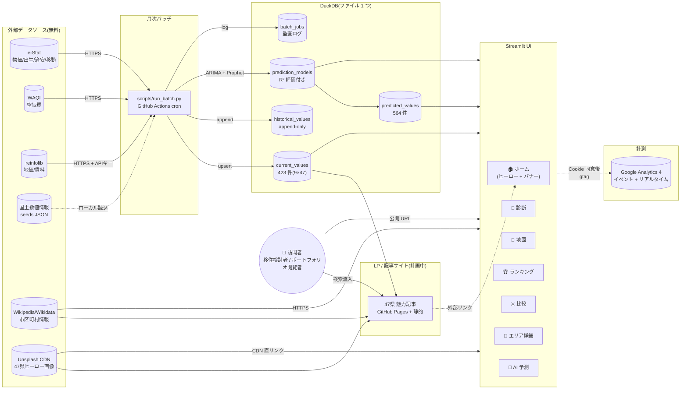
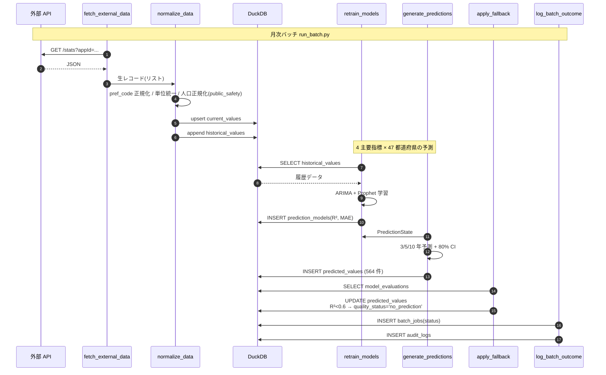
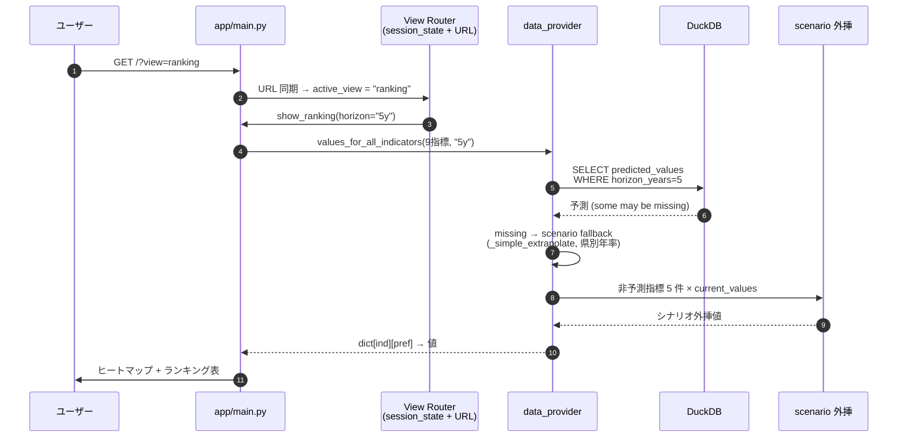
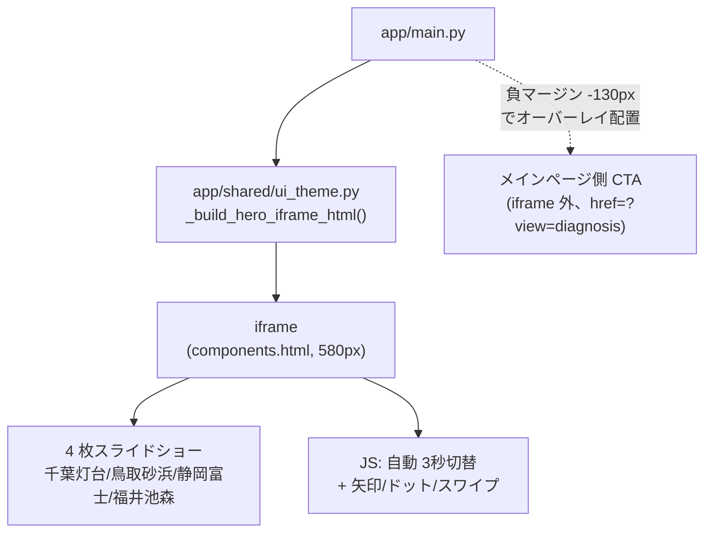
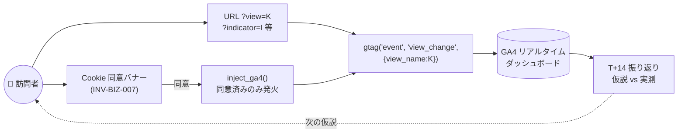

# 🏗️ MoveMap アーキテクチャ図と説明

> プロジェクトの構造を **図 + 文章** で理解するためのドキュメント。
> 顧客 / チームメンバーへの初回説明、開発者の onboarding、面接時の説明に使う。
>
> 最終更新:2026-06-05(DEC-016 mode C 公開承認後)

---

## 1. システム全体図(上空から見る)



### この図のポイント

- **外部 API は月次バッチでのみ呼ぶ**(ユーザーアクセス毎に呼ばない = 安定性 + API 制限回避)
- **DB は読み取り中心**(UI は SELECT のみ、書込みはバッチだけ)
- **6 セクション + ホーム = 7 view**、各 view が独立した URL(`?view=KEY`)
- **AI 予測モデルは別テーブル**(R² 評価値も保存 → 「AI 予測」タブで全公開、INV-BIZ-003)
- **画像は CDN 直リンク**(Streamlit Cloud のリポサイズ制限を回避、完全無料)
- **GA4 計測は Cookie 同意後のみ**(INV-BIZ-007 / opt-in 方式)
- **記事サイトは別レイヤ**(SEO 突破口、Streamlit 内 LP は SPA 制約があるため)

---

## 2. データフロー詳細(月次バッチ)



### UI 側のデータ取得フロー(ユーザーアクセス時)



### 主な不変条件(INV)で守られていること

| INV | 守られる性質 | 物理層 |
|---|---|---|
| **INV-BIZ-001** | 47 都道府県 × 9 指標が常に DB に存在 | DB FK + seed 検証 |
| **INV-BIZ-002** | `is_predictable=true` は主要 4 指標のみ | DB CHECK |
| **INV-BIZ-003** | R² < 0.6 の予測は `no_prediction` | アプリ層 + 単体テスト |
| **INV-BIZ-005** | UI は必ず免責バナー(disclaimer)を表示 | 静的検証(`test_invariants_static`) |
| **INV-BIZ-006** | mode C で「投資/不動産/移住助言ではない」明示 | 静的検証 |
| **INV-BIZ-007** | Cookie 同意取得後のみ GA4 注入 | コードレビュー + 動作 |
| **INV-BIZ-008** | UI フッターに法務リンク導線 | 静的検証 |
| **INV-DATA-007** | `historical_values` は append-only | DB 層強制(`HistoryProtectedConnection`) |
| **INV-EXT-001** | 外部 API 失敗時は前回値保持 | `apply_fallback` |
| **INV-IDEM-001** | 月内に複数回実行しても結果同等 | upsert + append-only history |

---

## 3. ディレクトリ構造(VSA)

```
MoveMap/
├── app/
│   ├── main.py                              # Streamlit エントリポイント、view router
│   ├── domain/                              # フレームワーク非依存の dataclass
│   │   ├── prefecture.py / indicator.py / values.py / prediction.py / batch.py / data_source.py
│   ├── shared/                              # 横断関心事
│   │   ├── config.py                        # .env 読込、Config dataclass
│   │   ├── db.py                            # DuckDB connect + HistoryProtectedConnection
│   │   ├── http_client.py                   # httpx + tenacity + truststore
│   │   ├── bootstrap.py                     # Streamlit Cloud 用 DB 自動初期化
│   │   ├── ui_theme.py                      # グローバル CSS、ヒーロー(components.html)、バナー
│   │   ├── logger.py
│   ├── features/
│   │   ├── map_view/                        # 🗾 地図/順位/詳細/診断/比較
│   │   │   ├── usecases/                    # show_map / show_ranking / show_comparison / show_diagnosis / show_prefecture_detail / show_model_detail / switch_indicator / switch_horizon
│   │   │   ├── components/heatmap.py        # Plotly Choropleth
│   │   │   ├── data_provider.py             # DB → dummy / scenario fallback ファサード
│   │   │   ├── ranking.py                   # 偏差値 + 加重平均
│   │   │   ├── regions.py                   # 地方マッピング + 主要都市
│   │   │   ├── images.py                    # Unsplash + Wikimedia ヒーロー画像
│   │   │   ├── wikipedia.py                 # 市区町村 Wiki 情報
│   │   │   ├── osm.py                       # 非日常スポット
│   │   │   ├── dummy.py                     # 決定的ダミー値生成
│   │   ├── data_pipeline/                   # 月次バッチ / モデル / 外部 API
│   │   │   ├── usecases/                    # fetch / normalize / upsert / append / train / evaluate / predict / fallback / log / run_batch
│   │   │   ├── sources/                     # estat / mlit_land_price / mlit_rent_index / env_soramame / gsi_hazard / mlit_transport
│   │   │   ├── models/                      # arima.py / prophet_model.py
│   │   ├── compliance/                      # 免責 / 同意 / 法務リンク
│   │   │   ├── disclaimer.py                # INV-BIZ-005/006
│   │   │   ├── cookie_consent.py            # INV-BIZ-007
│   │   │   ├── footer.py                    # INV-BIZ-008
│   │   │   ├── show_data_sources.py         # 出典表示
├── seeds/                                   # マスタ + 47県データ
│   ├── prefectures.csv / indicators.csv / data_sources.csv
│   ├── japan_prefectures.geojson            # ヒートマップ用
│   ├── municipalities.json / all_municipalities.json
│   ├── prefecture_images.json               # 47県ヒーロー画像 URL(Unsplash/Wikimedia)
│   ├── prefecture_image_overrides.json      # 県別クエリ上書き(自動取得が外れた場合用)
│   ├── movemap_sample.duckdb                # 4.99 MB のサンプル DB(Cloud cold start 用)
│   ├── hazard_scores.json / transport_facilities.json
│   ├── image_credits.md                     # INV-BIZ-008 用クレジット一覧
├── scripts/
│   ├── seed.py                              # DB 初期化(冪等) + 合成データ
│   ├── run_batch.py                         # 月次バッチエントリ
│   ├── fetch_geojson.py / fetch_prefecture_images.py
│   ├── generate_article_prototype.py        # 47県記事 自動生成プロトタイプ
│   ├── snapshot.py / restore.py             # DB スナップ/復元
│   ├── health_check.py
├── outputs/                                 # twin-build 設計成果物
│   ├── 00_problem.md 〜 99_review.md       # Phase 0-8
│   ├── decisions/DEC-016.md                 # 公開判断
│   ├── legal/terms.md / privacy_policy.md   # DEC-016 派生
│   ├── DEPLOYMENT.md / OPERATIONS.md / GA4_SETUP.md
│   ├── baseline.md                          # INV 一覧
│   ├── articles_prototype/                  # 自動生成記事の試作
├── docs/learning/                           # 本ドキュメント群
├── tests/                                   # unit / integration / smoke
├── .github/workflows/                       # ci.yml / monthly-batch.yml
├── requirements.txt / runtime.txt           # Streamlit Cloud 用
└── pyproject.toml / .python-version
```

---

## 4. View Router(ナビゲーション設計、2026-06-02 リニューアル)

### 旧設計(2026-05 まで)
サイドバー固定 + 6 タブ(`st.tabs`)で全 view 同時レンダリング。

### 新設計(2026-06-02 〜)
**サイドバー廃止 + state-based router** で 1 view ずつ描画。

```python
# app/main.py(抜粋)
_VALID_VIEWS = ("home", "diagnosis", "map", "ranking", "compare", "detail", "model")

# URL → session_state 同期(毎回チェック)
_qp_view = st.query_params.get("view")
_target_view = _qp_view if _qp_view in _VALID_VIEWS else "home"
if st.session_state.get("active_view") != _target_view:
    st.session_state["active_view"] = _target_view

# 描画分岐
if _active_view() == "home":
    render_hero()                # 4 枚スライド(components.html iframe)
    render_section_banners()     # 6 個の <a href="?view=KEY">
else:
    render_back_to_home_button() # st.button + state リセット
    show_<view>(...)             # diagnosis / map / ranking / ...
```

### 状態管理のポイント

- **session_state["active_view"]** が単一の真実(URL は表現)
- **URL ?view=KEY** はブックマーク・共有・直リンク用に同期
- **戻るボタン** は `query_params.clear()` + `session_state["active_view"]="home"` + `st.rerun()` で確実遷移
- **クエリパラメータが消えた = ホーム** という規約

---

## 5. ヒーロー実装の特殊事情(components.html iframe)



### なぜ iframe?

- `st.markdown(unsafe_allow_html=True)` は **DOMPurify** で `<script>` を除去する
- → JS 駆動の自動スライダーは `components.html()` 必須
- ただし iframe は sandbox により `window.top.location` 操作が制約
- → CTA「診断を始める」は iframe **外** にメインページの `<a href="?view=diagnosis">` で配置

---

## 6. データプロバイダ(`data_provider.py`)の責務

```
[UI(show_ranking 等)]
       ↓ values_for_all_indicators(["price_index", ...], "5y")
[data_provider.py]
       ├─ DB 存在 + データあり? → DB から取得
       │   ├─ predicted_values 行あり → そのまま採用
       │   ├─ quality_status='no_prediction' → scenario 外挿
       │   └─ predicted_values 行なし → scenario 外挿(2026-06-03 修正)
       ├─ 非予測指標(空気/災害/交通/治安/人口流入)→ current_values × scenario 年率
       └─ DB 空 → dummy(decisive hash-based)
       ↓
[UI:Plotly choropleth / DataFrame / メトリック]
```

**シナリオ外挿は地域別補正**:
- 三大都市圏(東京・大阪・名古屋圏)、地方中核(政令市等)、地方郡部 で年率係数が異なる
- 例:賃料 → 三大都市圏 +1.5%/年、中核 +0.5%、郡部 -0.2%

---

## 7. 計測駆動アーキ(2026-06-03 〜)



### イベント設計(計画中、Phase 2)

| イベント名 | パラメータ | 何を測るか |
|---|---|---|
| `view_change` | `view_name`, `previous_view` | どの画面が人気か / 動線 |
| `indicator_change` | `indicator` | どの観点が興味を引くか |
| `horizon_change` | `horizon` | 現在 vs 将来予測どちらを見るか |
| `diagnosis_complete` | (boolean フラグ) | 診断完走率 |
| `banner_click` | `banner_key` | ホーム → 各画面の流入経路 |

---

## 8. 公開 / デプロイ構成

### Phase 1(2026-05)
ローカル PC + ngrok 一時公開のみ(DEC-005「個人ツール限定」)。

### Phase 2(2026-06、現在)
DEC-016 で mode C(完全公開)解禁:
```
[GitHub training ブランチ]
    ↓ push
[Streamlit Cloud(無料)]
    ├─ requirements.txt + runtime.txt(python-3.11)
    ├─ Secrets: GA4_MEASUREMENT_ID / UNSPLASH_ACCESS_KEY
    ├─ seeds/movemap_sample.duckdb で cold start 高速化(bootstrap)
    └─ 公開 URL: https://movemap.streamlit.app/
                  ↓ 24/7 公開
[訪問者]
```

### Phase 3(計画、近日)
SEO 強化のため記事サイトを併設:
```
[GitHub Pages リポジトリ(別)]
    ├─ Jekyll/Astro で 47 県の魅力記事
    ├─ sitemap.xml / OG / JSON-LD 完全対応
    ├─ 月次自動再生成(GitHub Actions cron)
    └─ 公開 URL: movemap.koyama.dev/articles/<pref>/(独自ドメイン候補)
                 ↓ 内部リンク
[Streamlit 本体]
```

---

## 9. 設計トレードオフのまとめ(面接で説明する用)

| 課題 | 選択肢 | 採用 | 理由 |
|---|---|---|---|
| **UI フレームワーク** | Streamlit / Next.js / Flask + React | **Streamlit** | Python 単一言語、個人開発で最速、十分動く |
| **データベース** | DuckDB / SQLite / Postgres | **DuckDB** | OLAP に強い、ファイル 1 つ、Cloud デプロイ容易 |
| **予測モデル** | 単一(ARIMA) / アンサンブル | **ARIMA + Prophet** | 季節 + 変化点の両対応、商用 OK |
| **画像** | リポ内に保存 / CDN 直リンク | **CDN 直リンク**(Unsplash + Wikimedia) | リポサイズ軽量、Cloud 無料枠で動く |
| **HTML 注入** | `st.markdown` のみ / `components.html` 併用 | **両方** | meta タグは markdown、JS 必要なヒーローは iframe |
| **ナビ** | サイドバー固定 / state-based 1view 描画 | **state-based**(2026-06-02 移行) | ヒーロー + バナーで全画面ワイドビジュアル |
| **AI 仕上げ** | OpenAI / Claude API / GitHub Models | **GitHub Models** | 完全無料、PAT のみで動く、47 県記事に十分 |
| **公開先** | Streamlit Cloud / GitHub Pages / 両方 | **両方**(分業) | 機能は Streamlit、SEO は Pages |
| **計測** | ログを自前で / GA4 / Mixpanel | **GA4** | 無料、業界標準、後で GTM 化も容易 |
| **法務** | 個人ツール限定 / 公開許可 | **DEC-016 で公開許可** | terms + privacy + cookie consent で R-03 軽減 |

---

## 10. 拡張ポイント(今後の打ち手の入り口)

| 拡張 | 影響範囲 | 工数 |
|---|---|---|
| 新指標追加 | `seeds/indicators.csv` + `dummy.py` + 必要なら ETL adapter | 1-2h |
| 新外部 API | `data_pipeline/sources/<新>.py`(`_base.py` 継承)+ adapter テスト | 2-3h |
| 市区町村ドリルダウン | `domain/` に Municipality 追加、`features/` に新タブ | 8-12h |
| AI チャット相談 | 新 Usecase + Anthropic SDK 統合(課金あり)+ Cookie 同意拡張 | 6-10h |
| 独自ドメイン | DNS 設定 + Streamlit Cloud / Pages 設定 | 1-2h |
| 多言語(英) | i18n 仕組み導入(streamlit-i18n 等)+ 英訳作業 | 工数大 |
| 認証付き機能 | INV-AUTH 系の新設 + Streamlit Cloud Teams 移行 | 工数大 |

---

## 次に読む

- データ層・予測詳細 → `app/features/data_pipeline/usecases/run_batch.py` のコード
- UI ナビ詳細 → `app/main.py` の view router 部
- 設計判断の経緯 → `outputs/decisions/DEC-016.md`
- 自己テスト → [02_self_quiz.md](02_self_quiz.md)
- 顧客説明 → [04_pitch_deck_outline.md](04_pitch_deck_outline.md)
