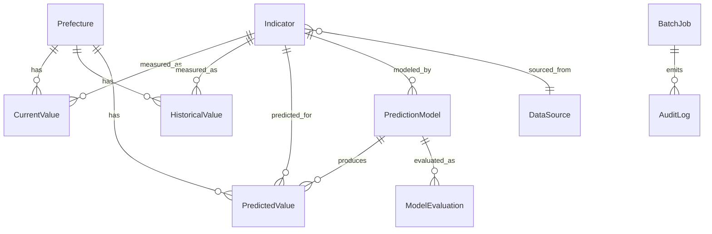

# システム要件

## 作成日
2026-05-17

## 入力ドキュメント
- `outputs/03_business_flow.md`

## このドキュメントの位置づけ

Phase 3 の業務フローを「**何をシステム化するか / しないか**」に分類し、システム機能(SF)・論理データモデル・CRUD 責任マトリクス・業務不変条件を確定する。
具体的な技術選定(DB・AI モデルライブラリ・フレームワーク)は Phase 5 で扱う。

---

## システム化の範囲

### システム化対象 - Feature A: `map_view`(MAP 表示・利用)

| SF-ID | 機能名 | 入力 | 処理 | 出力 | Phase 3 由来 |
|-------|--------|------|------|------|--------------|
| SF-001 | MAP 初期表示 | アクセス | DB から現在値・予測値・出典・モデル評価指標を取得 → MAP を描画 | 47都道府県の指標値 + 凡例 + 免責バナー | F2.1-2.3 |
| SF-002 | 指標切替 | 7指標から1つを選択 | 該当指標で再描画 | 該当指標のヒートマップ | F2.4 |
| SF-003 | 年次切替 | 現在/3/5/10年 から選択 | 該当年次で再描画。主要4指標のみ予測値あり、それ以外は「予測なし」フォールバック | 該当年次のヒートマップ | F2.5 |
| SF-004 | 都道府県詳細表示 | 都道府県クリック | 全指標の現在値+予測値+出典をパネル表示 | 詳細パネル | F2.7 |
| SF-005 | モデル根拠表示 | 「モデル詳細」リンククリック | 使用変数・モデル種別・R²/MAE 表示 | モデル詳細ページ | F2.6 |

### システム化対象 - Feature B: `data_pipeline`(月次バッチ)

| SF-ID | 機能名 | 入力 | 処理 | 出力 | Phase 3 由来 |
|-------|--------|------|------|------|--------------|
| SF-010 | バッチ起動 | スケジューラ(月初) | ETL ジョブの起動と BatchJob レコードの C | BatchJob 作成 | F1.1 |
| SF-011 | 外部データ取得 | DataSource の URL/API + 差分判定情報 | If-Modified-Since/ETag 等で差分判定(DE-01)→ 未更新ならスキップ、更新ありなら取得 | 生データ | F1.2 |
| SF-012 | データ正規化 | 生データ | 都道府県コード・単位・型を統一 | 正規化済データ | F1.3 |
| SF-013 | 現在値テーブル更新 | 正規化済データ | upsert | CurrentValue 更新 | F1.4 |
| SF-014 | 履歴テーブル append | 正規化済データ | append-only 追記 | HistoricalValue 追加 | F1.4 |
| SF-015 | 予測モデル再学習 | HistoricalValue + 指標別再学習頻度設定(DE-02) | 主要4指標について時系列モデル(候補: ARIMA/Prophet 等、具体は Phase 5)で再学習 | PredictionModel | F1.6 |
| SF-016 | モデル評価 | 学習済モデル + 評価用ホールドアウトデータ | R²/MAE を評価期間(DE-03 で確定)で計算 | ModelEvaluation | F1.7 |
| SF-017 | 予測値生成 | 学習済モデル + 品質基準 R²≥0.6 | 47都道府県 × 主要4指標 × 3時点(3/5/10年)の予測 | PredictedValue | F1.8-1.9 |
| SF-018 | フォールバック判定 | ModelEvaluation 結果 | R²<0.6 の指標は PredictedValue.quality_status='no_prediction' に設定 | quality_status 更新 | F1.8 |
| SF-019 | バッチログ記録 | 各 SF の成否情報 | BatchJob.status の更新 + AuditLog 書き込み | BatchJob / AuditLog 更新 | F1.10 |

### システム化対象 - Feature C: `compliance`(免責・出典)

| SF-ID | 機能名 | 入力 | 処理 | 出力 | 由来 |
|-------|--------|------|------|------|------|
| SF-020 | 免責表示 | アクセス | 「個人利用ツール」「投資助言ではない」を全画面で常時表示(R3.1) | 画面バナー / フッター | DE-04 |
| SF-021 | データ出典表示 | 指標選択時 | 各指標のデータソース URL・最終更新日を表示(R3.2) | 出典ラベル | Phase 1 法的・倫理面 |

### 非システム化対象 と 代替手段

| Step | 内容 | 非システム化の理由 | 代替手段 |
|------|------|----------------|--------|
| F2.7 候補絞り込みの記憶化 | 「お気に入り都道府県」「比較メモ」の保存 | 個人ツール限定で認証なし(MVP)、複数デバイス同期不要 | 紙のメモ / ブラウザのお気に入り / 別アプリ |
| F2.8 / F3 共有 | URL 共有、PDF エクスポート | UX-D-02 は Phase 4 ではスコープ外、3ヶ月 MVP のクリティカルパスに含めない | 画面共有・スクリーンショット・ブラウザ印刷機能 |
| 操作監査ログ | ユーザー操作の詳細記録 | 個人ツール、自分自身を監査する意味が薄い | アプリログ(コンソール / ファイル) |

---

## 論理データモデル

### ER 図

### エンティティ一覧

| エンティティ | 属性 | PK | FK | ライフサイクル | 鮮度要件 | 補足 |
|------------|------|----|----|------------|--------|------|
| `Prefecture` | code, name_ja, name_en, region, geo_centroid | code | — | master | 業務サイクル | 47件固定 |
| `Indicator` | id, name_ja, name_en, unit, category, is_predictable | id | source_id → DataSource | master | 業務サイクル | 7件(Should/Could で増やす余地)。主要4指標は is_predictable=true |
| `DataSource` | id, name, url, license, update_frequency | id | — | master | 業務サイクル | X-01〜X-06 等(6件以上) |
| `CurrentValue` | value, measured_at, updated_at, status | (prefecture_code, indicator_id) | Prefecture.code, Indicator.id | transactional | 月次(月次バッチで更新) | 47×7=329 セル |
| `HistoricalValue` | value, measured_at, recorded_at | id(surrogate) | Prefecture.code, Indicator.id | append_only_history | — | 月次 append、過去変更不可 |
| `PredictionModel` | model_type, trained_at, parameters, features_used, training_data_range | id | Indicator.id | transactional | 業務サイクル | 主要4指標 × バージョン |
| `ModelEvaluation` | r_squared, mae, evaluated_at, evaluation_period | id(surrogate) | PredictionModel.id | append_only_history | — | 学習毎に1件 |
| `PredictedValue` | value, ci_lower, ci_upper, quality_status, predicted_at | (prefecture_code, indicator_id, horizon_years) | Prefecture.code, Indicator.id, PredictionModel.id | transactional | 月次 | 47×4指標×3時点=564 セル |
| `BatchJob` | job_type, started_at, ended_at, status, records_processed, error_details | id(surrogate) | — | append_only_history | — | 月次バッチ毎 |
| `AuditLog` | event_type, target, actor, occurred_at, details | id(surrogate) | — | append_only_history | — | システム監査 |

### 関係性のメモ

- `Indicator.is_predictable=true` の Indicator のみ `PredictionModel` が存在する
- `CurrentValue` は同一 (prefecture, indicator) 組合せで常に1件(月次上書き)
- `HistoricalValue` は append-only で過去変更不可
- `PredictedValue.quality_status` には `good` / `no_prediction` の2値

---

## CRUD 責任マトリクス

| SF \ Entity | Pref | Ind | DS | CurV | HistV | PredM | ModelE | PredV | BJob | AuditL |
|-------------|------|-----|----|----|----|-------|--------|-------|------|--------|
| SF-001 MAP 初期表示 | R | R | R | R | — | — | R | R | — | — |
| SF-002 指標切替 | — | R | — | R | — | — | — | R | — | — |
| SF-003 年次切替 | — | — | — | R | — | — | — | R | — | — |
| SF-004 都道府県詳細 | R | R | R | R | — | — | — | R | — | — |
| SF-005 モデル根拠 | — | R | — | — | — | R | R | — | — | — |
| SF-010 バッチ起動 | — | — | — | — | — | — | — | — | **C** | — |
| SF-011 外部データ取得 | — | — | R | — | — | — | — | — | U | — |
| SF-012 データ正規化 | — | — | — | — | — | — | — | — | U | — |
| SF-013 現在値テーブル更新 | — | — | — | **C, U** | — | — | — | — | U | — |
| SF-014 履歴テーブル append | — | — | — | — | **C** | — | — | — | U | — |
| SF-015 予測モデル再学習 | — | — | — | — | R | **C** | — | — | U | — |
| SF-016 モデル評価 | — | — | — | — | — | R | **C** | — | U | — |
| SF-017 予測値生成 | — | — | — | — | — | R | — | **C, U** | U | — |
| SF-018 フォールバック判定 | — | — | — | — | — | — | R | **U** | U | — |
| SF-019 バッチログ記録 | — | — | — | — | — | — | — | — | **U** | **C** |
| SF-020 免責表示 | — | — | — | — | — | — | — | — | — | — |
| SF-021 データ出典表示 | — | — | R | — | — | — | — | — | — | — |

**凡例**: C=Create, R=Read, U=Update, D=Delete, —=操作なし

### 集約境界レッドフラグ判定

| SF | 状況 | 集約境界としての判断 |
|----|------|---------------------|
| SF-013 | CurrentValue を C,U | 同一集約内 → 問題なし |
| SF-017 | PredictedValue を C,U + PredictionModel R | 同一集約内 → 問題なし |
| SF-019 | BatchJob U + AuditLog C | 異なる集約。auditability の責任なので Phase 5 で分離するか検討 |

---

## 例外処理・監査・ログ要件

### 例外処理

Phase 3 の補償経路 C-01〜C-07 をシステム要件として継承(`03_business_flow.md` 参照)。Phase 4 で追加:

| ID | 内容 |
|----|------|
| EX-001 | Unhandled exception 時はスタックトレースを AuditLog に書き出し、ユーザー UI には汎用エラー画面表示 |
| EX-002 | UI 描画失敗時(F2.3-2.5): リトライ → 連続失敗時はエラーバナー |
| EX-003 | F1 バッチ全体失敗時: BatchJob.status='failure' を記録、次回バッチで前回値を維持 |

### 監査要件(個人ツールのため軽量)

- バッチジョブの開始・終了・成否は BatchJob に必須記録
- データ更新の差分件数は BatchJob.records_processed に記録
- ユーザー操作(SF-001〜005)の監査は MVP 範囲外

### ログ要件

| 種別 | 対象 | 保持期間 | 保存先 |
|------|------|--------|--------|
| 監査ログ(運用) | バッチジョブ・モデル評価 | 1年 | AuditLog / BatchJob テーブル |
| エラーログ(アプリ) | EX-001 系のスタックトレース | 30日 | アプリログ(ファイル / コンソール) |
| アクセスログ(UI) | MVP 範囲外 | — | — |

---

## 業務不変条件

### INV-BIZ(業務ルール)

| ID | 種類 | 内容 | 検証方法 |
|----|------|------|--------|
| INV-BIZ-001 | state | Prefecture テーブルは 47 都道府県以外のレコードを持ってはならない | DB 制約 + 起動時シード検証 |
| INV-BIZ-002 | state | `is_predictable=true` の Indicator は主要4指標(物価/地価/賃料/出生数)のみ | DB 制約 + シード検証 |
| INV-BIZ-003 | transition | R²<0.6 のモデルから生成された PredictedValue は `quality_status='no_prediction'` でなければならない | SF-018 の単体テスト + バッチ後のアサート |
| INV-BIZ-004 | transition | 月次バッチ開始時に BatchJob レコードが C されなければならない | SF-010 の単体テスト |
| INV-BIZ-005 | state | MAP 表示時(SF-001/002/003/004)は常に免責バナーが表示されなければならない | E2E テスト + フロントエンドの常時マウントコンポーネント |

### INV-DATA(データ整合性)

| ID | 種類 | 内容 | 検証方法 |
|----|------|------|--------|
| INV-DATA-001 | structural | CurrentValue.prefecture_code は Prefecture.code に必ず存在 | DB FK 制約 |
| INV-DATA-002 | structural | CurrentValue (prefecture_code, indicator_id) は一意 | DB UNIQUE 制約(PK) |
| INV-DATA-003 | structural | PredictedValue (prefecture_code, indicator_id, horizon_years) は一意 | DB UNIQUE 制約(PK) |
| INV-DATA-004 | structural | `is_predictable=false` の Indicator は PredictedValue を持ってはならない | アプリ層バリデーション + バッチ事後検証 |
| INV-DATA-005 | structural | PredictedValue は必ず `is_predictable=true` の Indicator を参照 | INV-DATA-004 の対偶として同じテスト |
| INV-DATA-006 | state | PredictedValue.horizon_years は {3, 5, 10} のいずれか | DB CHECK 制約 |
| INV-DATA-007 | structural | HistoricalValue は append-only(UPDATE/DELETE 禁止) | アプリ層強制 + DB トリガー(オプション) |
| INV-DATA-008 | state | DataSource.update_frequency は {monthly, quarterly, yearly, irregular} のいずれか | DB CHECK 制約 |

---

## Phase 1 要件のカバー状況

| Phase 1 要件 | 対応 SF |
|------------|--------|
| 47都道府県の MAP 比較 | SF-001, SF-002, SF-003, SF-004 |
| 7指標の現在値表示 | SF-001(初期), SF-002(切替), SF-004(詳細) |
| 主要4指標の AI 予測値表示(3/5/10年) | SF-003, SF-017, SF-018(フォールバック) |
| AI 予測モデルの根拠ページ | SF-005 |
| 個人利用前提の免責表示 | SF-020 |
| データ出典の明示 | SF-021 |
| 月次データ更新 | SF-010〜SF-019 |

Must 要件カバー率: **100%**

---

## Phase 5 へ持ち越す論点

| ID | 内容 | 出所 |
|----|------|------|
| TECH-01 | DB 選定(SQLite / PostgreSQL / DuckDB) | ES-02 |
| TECH-02 | バックエンド言語・フレームワーク選定 | Phase 5 |
| TECH-03 | フロントエンド技術(React + Leaflet / D3 / Deck.gl 等) | Phase 5 / UX-D-04 検証 |
| TECH-04 | AI モデルライブラリの具体選定(statsmodels / Prophet / scikit-learn 等) | D-04 |
| TECH-05 | スケジューラ選定(cron / GitHub Actions / Airflow 軽量版) | DE-02 |
| TECH-06 | データソース別の取得実装(API クライアント設計) | D-01, D-03 |
| TECH-07 | F1.5 ETL→予測の同期/非同期実行方針 | ES-01 |
| DESIGN-01 | データソースの段階的導入順序(MVP 初回は 2 ソース等) | ES-03 |
| DESIGN-02 | 災害リスク指標の分解 or 合成ロジック | D-02 |
| DESIGN-03 | 「環境(空気)」の指標を PM2.5/AQI 等で確定 | D-01 |
| DESIGN-04 | ヒートマップ 5 階層 vs 3 階層のユーザーテスト | UX-D-04 |
| DESIGN-05 | 「予測なし」の表示方法(灰色 / ハッチング / 非表示) | UX-D-01 |
| DESIGN-06 | URL/PDF 共有機能の要否 | UX-D-02 |
| LEGAL-01 | データソース別の利用規約確認・クレジット表示 | L-01 |
| LEGAL-02 | コード公開時のライセンス選定とデータ同梱可否 | L-03, ES-04 |
| OPS-01 | F1.4 履歴テーブル保管期間の確定 | DE-05 |
| OPS-02 | R² 評価期間の定義(クロスバリデーションのデータ範囲) | DE-03 |

---

## Phase 3 持ち越し論点への対応状況(Phase 4 で扱った範囲)

| ID | 内容 | Phase 4 での扱い |
|----|------|----------------|
| DE-01 | 差分判定 | SF-011 の処理仕様に明示 |
| DE-02 | 指標別再学習頻度 | SF-015 の処理仕様に明示(具体は Phase 5) |
| DE-04 | 免責バナー常時表示 | SF-020 + INV-BIZ-005 で必須化 |
| DE-03, DE-05 | R² 評価期間、履歴保管期間 | Phase 5 へ持ち越し(OPS-01, OPS-02) |

---

## 備考

- 出力モード: 単一ファイルモード(`04_system_requirements.md`)を採用。Phase 3 との一貫性を維持
- 業務不変条件は `outputs/baseline.md` にも同期(Step 8.4 の必須処理)
- Phase 4 完了後は `/review`(業務設計レビュー)を実行してから Phase 5 へ
