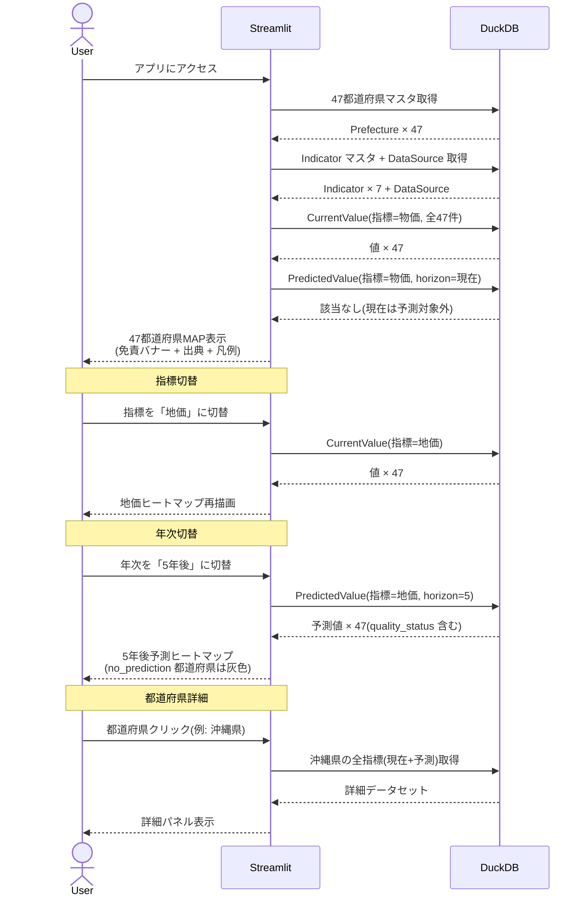
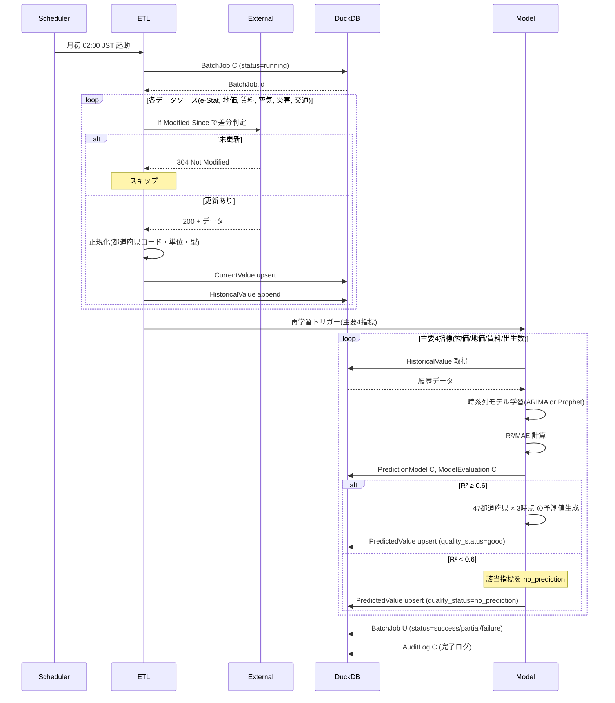

# 設計書 01: シーケンス図

## 作成日
2026-05-17

## 参加者凡例

| 略称 | 参加者 | 説明 |
|------|--------|------|
| User | H-01 ユーザー | 主アクター(個人) |
| Streamlit | S-03 MAP表示エンジン | フロントエンド・サーバー兼用(Streamlit) |
| ETL | S-01 ETL Job | Python バッチ |
| Model | S-02 AI 予測モデル | Python(statsmodels/Prophet) |
| DuckDB | DB | 組み込み DuckDB |
| External | X-01〜X-06 | 公的データソース |
| Scheduler | GitHub Actions cron | 月初トリガー |

---

## F2: 利用フロー(ShowMap)

### 例外パターン

- **C-06 DB 接続失敗**: Streamlit が DuckDB へのアクセス失敗 → ローカルキャッシュ表示 → なければエラー画面
- **C-07 描画失敗**: Plotly レンダリング失敗 → 単純再描画 retry → 連続失敗時はエラーバナー

---

## F1: 月次データ更新フロー(RunBatch)

### 例外パターン

- **C-01 外部API失敗**: 指数バックオフ 3 回 → 失敗時は前回値保持(R1.3)、UI に「未更新」
- **C-02 3 回連続失敗**: UI に警告通知、バッチログ記録
- **C-03 DB 書き込み失敗**: Retry → 失敗時はトランザクション巻き戻し
- **C-04 R² < 0.6**: フォールバック「予測なし」表示
- **C-05 学習プロセス失敗**: Retry 1 回 → 失敗時は旧モデル+旧予測値維持
- **EX-003 バッチ全体失敗**: BatchJob.status='failure' 記録、次回バッチで前回値維持

---

## シーケンス対象外の Usecase

| Usecase | 理由 |
|---------|------|
| `SwitchIndicator` | ShowMap の一部、Mermaid 化不要 |
| `SwitchHorizon` | 同上 |
| `ShowPrefectureDetail` | 同上(上記 F2 内に表現済み) |
| `ShowModelDetail` | 単純な DB 読込→表示で図示不要 |
| `ShowDisclaimer` | 静的UI、図示不要 |
| `ShowDataSources` | DataSource 読込→ラベル表示、図示不要 |
| `FetchExternalData`/`NormalizeData`/`UpsertCurrentValues`/`AppendHistory`/`RetrainModels`/`EvaluateModels`/`GeneratePredictions`/`ApplyFallback`/`LogBatchOutcome` | RunBatch のサブステップとして上記 F1 内に表現済み |
