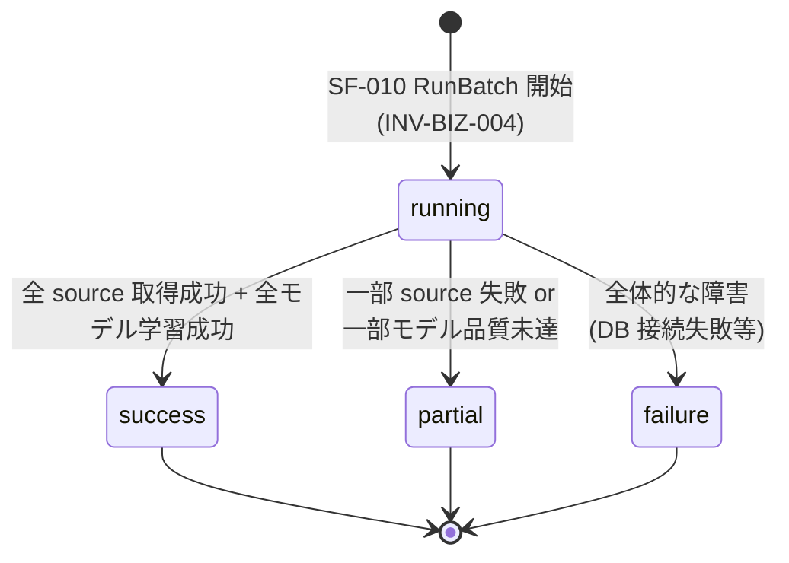
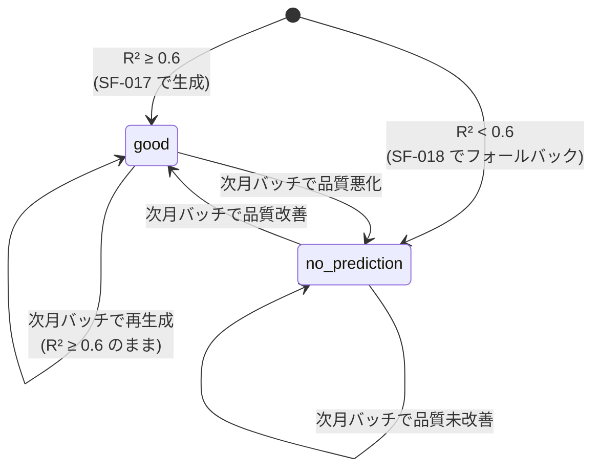
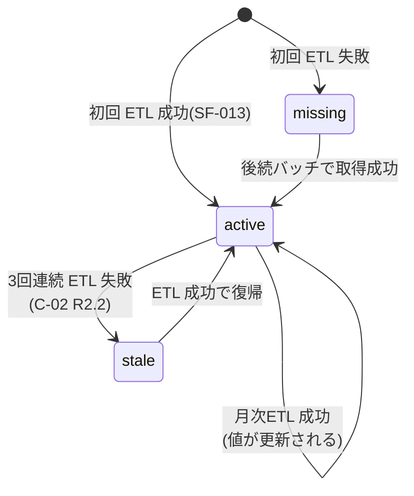

# 設計書 03: 状態遷移

## 作成日
2026-05-17

## 状態を持つエンティティ

| エンティティ | 状態フィールド | 値域 |
|------------|------------|------|
| `BatchJob` | status | running / success / partial / failure |
| `PredictedValue` | quality_status | good / no_prediction |
| `CurrentValue` | status | active / missing / stale |

`PredictionModel` / `ModelEvaluation` は単一状態(作成のみ、更新なし)のため状態遷移不要。

---

## BatchJob 状態遷移

| 遷移 | 条件 | 補償経路 |
|------|------|---------|
| `[*] → running` | RunBatch 起動時に新規 BatchJob レコード作成 | INV-BIZ-004 を満たすこと |
| `running → success` | 全 SF が成功 | — |
| `running → partial` | 一部失敗(C-01 1回〜2回失敗で前回値保持、C-04 一部 R²未達) | partial でも次回バッチで自動回復 |
| `running → failure` | DB 書込失敗(C-03)、システム例外(EX-001) | 次回バッチで前回値維持(EX-003) |

---

## PredictedValue.quality_status 遷移

| 遷移 | 条件 | 関連不変条件 |
|------|------|------------|
| `[*] → good` | SF-016 評価で R² ≥ 0.6 | INV-BIZ-003 を満たす |
| `[*] → no_prediction` | SF-016 評価で R² < 0.6(C-04) | INV-BIZ-003 を満たす |
| `* → *` | 月次バッチで再評価 → 再分類 | — |

---

## CurrentValue.status 遷移

| 遷移 | 条件 |
|------|------|
| `[*] → active` | データ取得成功 |
| `[*] → missing` | データ取得失敗(初回) |
| `active → stale` | 3回連続失敗(R2.2 警告対象) |
| `stale → active` | バッチ復帰 |

---

## Coverage 影響

| Usecase | 状態遷移カバレッジ |
|---------|----------------|
| `RunBatch` | BatchJob 状態を作成・遷移 |
| `UpsertCurrentValues` | CurrentValue.status を遷移 |
| `GeneratePredictions` | PredictedValue.quality_status を確定 |
| `ApplyFallback` | quality_status を no_prediction に |
| その他 Usecase | 状態遷移なし |
