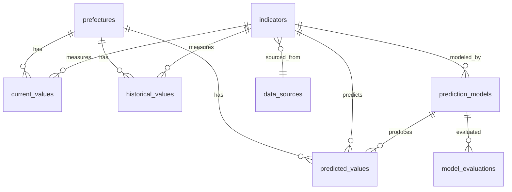

# 設計書 04: データ設計

## 作成日
2026-05-17

## DB: DuckDB

物理スキーマ・インデックス・集約境界詳細を本ドキュメントで確定する。

---

## 物理 ERD

---

## テーブル定義

### `prefectures`(都道府県マスタ)

| カラム | 型 | NULL | PK | デフォルト | 説明 |
|--------|----|------|----|----|------|
| code | VARCHAR(2) | NO | PK | — | JIS X 0401 都道府県コード (01〜47) |
| name_ja | VARCHAR(20) | NO | | — | 日本語名 |
| name_en | VARCHAR(40) | NO | | — | 英語名 |
| region | VARCHAR(20) | NO | | — | 北海道/東北/関東/中部/近畿/中国/四国/九州 |
| centroid_lat | DOUBLE | NO | | — | 重心緯度 |
| centroid_lon | DOUBLE | NO | | — | 重心経度 |
| created_at | TIMESTAMP | NO | | NOW() | — |

**インデックス**: なし(PK のみ、47件)
**制約**: `code` は 2 桁数字文字列

### `indicators`(指標マスタ)

| カラム | 型 | NULL | PK | デフォルト | 説明 |
|--------|----|------|----|----|------|
| id | VARCHAR(20) | NO | PK | — | 例: `price_index` |
| name_ja | VARCHAR(40) | NO | | — | 例: 物価指数 |
| name_en | VARCHAR(40) | NO | | — | 例: PriceIndex |
| unit | VARCHAR(20) | NO | | — | 例: `point`, `JPY/m2` |
| category | VARCHAR(20) | NO | | — | `must` / `should` / `could` |
| is_predictable | BOOLEAN | NO | | FALSE | 主要4指標は TRUE |
| source_id | VARCHAR(20) | NO | FK | — | data_sources.id |
| created_at | TIMESTAMP | NO | | NOW() | — |

**インデックス**: `idx_indicators_source` (source_id)
**制約**:
- `is_predictable=TRUE` の indicators は `must` カテゴリの主要4指標(物価/地価/賃料/出生数)のみ → INV-BIZ-002
- CHECK `category IN ('must','should','could')`

### `data_sources`(データソースマスタ)

| カラム | 型 | NULL | PK | デフォルト | 説明 |
|--------|----|------|----|----|------|
| id | VARCHAR(20) | NO | PK | — | 例: `estat`, `land_price` |
| name | VARCHAR(60) | NO | | — | 例: 政府統計の総合窓口(e-Stat) |
| url | VARCHAR(200) | NO | | — | 公式 URL |
| license | VARCHAR(60) | NO | | — | 例: `政府標準利用規約 2.0` |
| update_frequency | VARCHAR(20) | NO | | — | `monthly` / `quarterly` / `yearly` / `irregular` |
| created_at | TIMESTAMP | NO | | NOW() | — |

**制約**: CHECK `update_frequency IN ('monthly','quarterly','yearly','irregular')` → INV-DATA-008

### `current_values`(現在値)

| カラム | 型 | NULL | PK | デフォルト | 説明 |
|--------|----|------|----|----|------|
| prefecture_code | VARCHAR(2) | NO | PK | — | FK → prefectures.code |
| indicator_id | VARCHAR(20) | NO | PK | — | FK → indicators.id |
| value | DOUBLE | YES | | — | 値(取得失敗時は NULL) |
| measured_at | DATE | YES | | — | 計測日(データ提供元) |
| updated_at | TIMESTAMP | NO | | NOW() | DB 更新日 |
| status | VARCHAR(10) | NO | | `'active'` | active / missing / stale |

**インデックス**: `idx_current_values_indicator` (indicator_id)
**制約**:
- 複合 PK → INV-DATA-002
- FK → INV-DATA-001
- CHECK `status IN ('active','missing','stale')`

### `historical_values`(履歴値、append-only)

| カラム | 型 | NULL | PK | デフォルト | 説明 |
|--------|----|------|----|----|------|
| id | BIGINT | NO | PK | identity | サロゲート |
| prefecture_code | VARCHAR(2) | NO | FK | — | FK → prefectures.code |
| indicator_id | VARCHAR(20) | NO | FK | — | FK → indicators.id |
| value | DOUBLE | NO | | — | 値 |
| measured_at | DATE | NO | | — | 計測日 |
| recorded_at | TIMESTAMP | NO | | NOW() | DB 登録日 |

**インデックス**: `idx_historical_pref_ind_date` (prefecture_code, indicator_id, measured_at)
**制約**:
- アプリ層で UPDATE/DELETE 禁止(INV-DATA-007)
- 削除カスケード: なし(append-only のため)

### `prediction_models`(予測モデル)

| カラム | 型 | NULL | PK | デフォルト | 説明 |
|--------|----|------|----|----|------|
| id | BIGINT | NO | PK | identity | サロゲート |
| indicator_id | VARCHAR(20) | NO | FK | — | FK → indicators.id |
| model_type | VARCHAR(20) | NO | | — | `arima` / `sarima` / `prophet` |
| trained_at | TIMESTAMP | NO | | NOW() | 学習完了日時 |
| parameters | JSON | NO | | — | モデルパラメータ |
| features_used | JSON | NO | | — | 使用変数リスト |
| training_data_range | JSON | NO | | — | `{from: "...", to: "..."}` |

**インデックス**: `idx_models_indicator_trained` (indicator_id, trained_at DESC)
**制約**:
- `indicator_id` は `is_predictable=TRUE` の indicators のみ(アプリ層で検証) → INV-DATA-005
- CHECK `model_type IN ('arima','sarima','prophet')`

### `model_evaluations`(モデル評価、append-only)

| カラム | 型 | NULL | PK | デフォルト | 説明 |
|--------|----|------|----|----|------|
| id | BIGINT | NO | PK | identity | サロゲート |
| model_id | BIGINT | NO | FK | — | FK → prediction_models.id |
| r_squared | DOUBLE | NO | | — | R² |
| mae | DOUBLE | NO | | — | Mean Absolute Error |
| evaluated_at | TIMESTAMP | NO | | NOW() | — |
| evaluation_period | JSON | NO | | — | `{from: "...", to: "..."}` (OPS-02 対応) |

**インデックス**: `idx_evaluations_model` (model_id)
**制約**: アプリ層で UPDATE/DELETE 禁止(append-only)

### `predicted_values`(予測値)

| カラム | 型 | NULL | PK | デフォルト | 説明 |
|--------|----|------|----|----|------|
| prefecture_code | VARCHAR(2) | NO | PK | — | FK → prefectures.code |
| indicator_id | VARCHAR(20) | NO | PK | — | FK → indicators.id |
| horizon_years | SMALLINT | NO | PK | — | 3 / 5 / 10 のいずれか |
| value | DOUBLE | YES | | — | 予測値(quality_status=no_prediction の場合 NULL) |
| ci_lower | DOUBLE | YES | | — | 信頼区間下限(任意) |
| ci_upper | DOUBLE | YES | | — | 信頼区間上限(任意) |
| quality_status | VARCHAR(20) | NO | | `'good'` | good / no_prediction |
| model_id | BIGINT | YES | FK | — | FK → prediction_models.id |
| predicted_at | TIMESTAMP | NO | | NOW() | — |

**インデックス**: `idx_predicted_indicator_horizon` (indicator_id, horizon_years)
**制約**:
- 複合 PK → INV-DATA-003
- CHECK `horizon_years IN (3,5,10)` → INV-DATA-006
- CHECK `quality_status IN ('good','no_prediction')`
- アプリ層: `indicator_id` は `is_predictable=TRUE` のみ → INV-DATA-004/005
- INV-BIZ-003: `quality_status='no_prediction'` は R²<0.6 から派生

### `batch_jobs`(バッチジョブ、append-only)

| カラム | 型 | NULL | PK | デフォルト | 説明 |
|--------|----|------|----|----|------|
| id | BIGINT | NO | PK | identity | サロゲート |
| job_type | VARCHAR(20) | NO | | — | `monthly_etl` |
| started_at | TIMESTAMP | NO | | NOW() | — |
| ended_at | TIMESTAMP | YES | | — | NULL = 実行中 |
| status | VARCHAR(20) | NO | | `'running'` | running / success / partial / failure |
| records_processed | INTEGER | YES | | 0 | 処理件数 |
| error_details | TEXT | YES | | — | 失敗時のメッセージ |

**インデックス**: `idx_batchjobs_started` (started_at DESC)
**制約**: CHECK `status IN ('running','success','partial','failure')`

### `audit_logs`(監査ログ、append-only)

| カラム | 型 | NULL | PK | デフォルト | 説明 |
|--------|----|------|----|----|------|
| id | BIGINT | NO | PK | identity | サロゲート |
| event_type | VARCHAR(40) | NO | | — | 例: `batch_completed`, `model_evaluated` |
| target | VARCHAR(40) | YES | | — | エンティティ名 + id |
| actor | VARCHAR(20) | NO | | `'system'` | 個人ツールのためほぼ常に system |
| occurred_at | TIMESTAMP | NO | | NOW() | — |
| details | JSON | YES | | — | 詳細情報 |

**インデックス**: `idx_audit_occurred` (occurred_at DESC)
**保存期間**: 1年(OPS-01)。古いレコードは月初に DELETE(append-only 原則の例外、Phase 7 で実装方針確定)

---

## 集約境界詳細(Theme 3 第二段階、確定)

### Aggregate: `IndicatorAggregate`

| 項目 | 確定内容 |
|------|--------|
| Root | `indicators` |
| Boundary Members | `indicators` + `data_sources`(複製、本集約は読み取り中心) |
| 不変条件 | INV-BIZ-002 (state), INV-DATA-008 (state): DB CHECK 制約 |
| Cross-Boundary References | なし(他集約から参照される側) |
| 削除カスケード方針 | なし(master データ、削除しない方針) |
| Transaction Scope | seeds 投入時のみ |

### Aggregate: `RegionMeasurement`

| 項目 | 確定内容 |
|------|--------|
| Root | `prefectures` |
| Boundary Members | `prefectures` + `current_values` + `historical_values` |
| 不変条件 | INV-BIZ-001 (state), INV-DATA-001/002 (structural), INV-DATA-007 (structural) |
| 検証方法 | DB FK + UNIQUE + アプリ層トリガー(historical の UPDATE/DELETE 禁止) |
| Cross-Boundary References | indicators.id を ID のみ参照(FK でも実体は読まない) |
| 削除カスケード方針 | prefectures は削除されない(マスタ固定) |
| Transaction Scope | ETL(SF-013/014)で current_values upsert + historical_values insert を同一 TX |

### Aggregate: `Prediction`

| 項目 | 確定内容 |
|------|--------|
| Root | `prediction_models` |
| Boundary Members | `prediction_models` + `model_evaluations` + `predicted_values` |
| 不変条件 | INV-BIZ-003 (transition), INV-DATA-003/004/005 (structural), INV-DATA-006 (state) |
| 検証方法 | DB FK + UNIQUE + CHECK + アプリ層検証(is_predictable) |
| Cross-Boundary References | prefectures.code, indicators.id を ID のみ参照 |
| 削除カスケード方針 | prediction_models 削除時 → predicted_values, model_evaluations は保持(履歴) |
| Transaction Scope | RetrainModels + EvaluateModels + GeneratePredictions を同一 TX |

### Aggregate: `BatchExecution`

| 項目 | 確定内容 |
|------|--------|
| Root | `batch_jobs` |
| Boundary Members | `batch_jobs` + `audit_logs`(関連するイベントのみ) |
| 不変条件 | INV-BIZ-004 (transition) |
| 検証方法 | アプリ層: RunBatch 開始時に batch_jobs C を必須化 |
| Cross-Boundary References | なし |
| 削除カスケード方針 | batch_jobs は古いものを 1 年で物理削除(OPS-01) |
| Transaction Scope | バッチ完了時に batch_jobs U + audit_logs C を同一 TX |

---

## 種別 enum の処理分岐表(`indicators.category` + `is_predictable`)

| category | is_predictable | UI 表示 | 予測値 | 備考 |
|---------|--------------|--------|--------|------|
| must | TRUE | 現在値+予測値 表示 | あり(3/5/10年) | 主要4指標(物価/地価/賃料/出生数) |
| must | FALSE | 現在値のみ表示 | なし | 環境/災害/交通(Should 拡張で予測対象に) |
| should | TRUE | 現在値+予測値 | あり | Should 段階 |
| should | FALSE | 現在値のみ | なし | Should 段階(医療/市区町村粒度等) |
| could | * | 表示優先度低 | 任意 | 気候等 |

実装時は `shared/indicator_matrix.py` に一元化(Phase 7 でマトリクス参照型実装)。

---

## Seeds(マスタデータ初期投入)

- `seeds/prefectures.csv`: 47都道府県 + 地域コード + 重心緯度経度
- `seeds/indicators.csv`: 7指標(初期) + is_predictable 4 件
- `seeds/data_sources.csv`: 6 ソース

初期化は `scripts/seed.py` で実行。アイドポテント(同じ id があれば skip)。

---

## 論理 ERD(Phase 4)からの差分

| Phase 4 論理 | Phase 6 物理 | 備考 |
|------------|-----------|------|
| エンティティ名 PascalCase | テーブル名 snake_case(複数形) | DuckDB 慣例 |
| 属性名 | カラム名 snake_case | — |
| FK は属性として明示 | FK は実 DB 制約 + アプリ層検証 | — |
| 集約境界(粗く) | 集約境界詳細(削除カスケード/TX スコープ確定) | Theme 3 第二段階 |

---

## Coverage 影響(checkpoint: data)

| Usecase | data カバレッジ |
|---------|--------------|
| `RunBatch` etc. F-B usecases | 各 entity 関連で covered |
| `ShowMap`, `SwitchIndicator`, etc. F-A | 読み取りのため covered |
| `ShowDisclaimer`, `ShowDataSources` | 静的/データ参照、covered |
