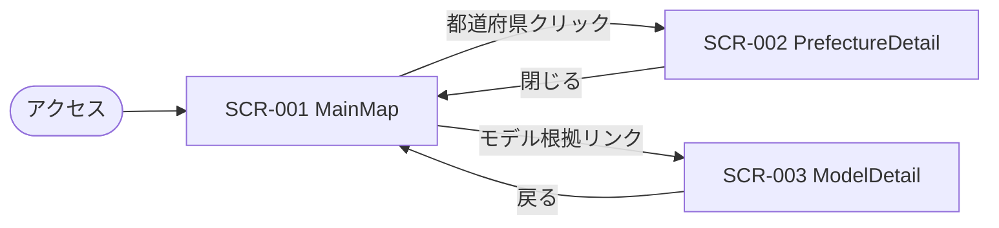

# 設計書 05: 画面設計

## 作成日
2026-05-17

## UI フレームワーク
Streamlit 1.x + Plotly choropleth

## 画面一覧

| 画面 ID | 画面名 | エントリ | 対応 Usecase |
|--------|--------|--------|------------|
| SCR-001 | MainMap | `/` (app/main.py) | ShowMap / SwitchIndicator / SwitchHorizon / ShowDisclaimer / ShowDataSources |
| SCR-002 | PrefectureDetail | サイドパネル(モーダル風) | ShowPrefectureDetail |
| SCR-003 | ModelDetail | `/model_detail`(Streamlit multi-page) | ShowModelDetail |

---

## SCR-001: MainMap(メイン画面)

### ワイヤーフレーム

```
┌─────────────────────────────────────────────────────────────────┐
│  MoveMap — 地方移住MAP                                          │
│  ⚠️ 個人利用ツール。投資助言ではありません。 [出典: e-Stat 他]   │← 免責バナー (SF-020, INV-BIZ-005)
├──────────┬───────────────────────────────────────┬────────────┤
│ サイドバー │                                       │  凡例       │
│          │                                       │            │
│ 指標選択   │      ┌────────────────────────┐      │ 高 ▓        │
│ [ ] 物価   │      │                          │     │   ▒        │
│ [○] 地価   │      │    日本地図ヒートマップ     │     │   ░        │
│ [ ] 賃料   │      │       (47都道府県)         │     │ 低 □        │
│ [ ] 出生数 │      │                          │     │            │
│ [ ] 環境   │      │   ※ クリックで詳細パネル    │     │ □ 予測なし   │
│ [ ] 災害   │      │                          │     │            │
│ [ ] 交通   │      └────────────────────────┘      │            │
│          │                                       │            │
│ 年次選択   │                                       │            │
│ ( ) 現在   │                                       │            │
│ ( ) 3年後  │                                       │            │
│ ( ) 5年後  │                                       │            │
│ ( ) 10年後 │                                       │            │
│          │                                       │            │
│ [モデル根拠]│                                       │            │
└──────────┴───────────────────────────────────────┴────────────┘
```

### UI 仕様

| 要素 | 種別 | 仕様 |
|------|------|------|
| 免責バナー | `st.error` or `st.info` (上部固定) | 全画面で常時表示(INV-BIZ-005)。「個人利用ツール。投資助言ではありません」+ 出典リンク |
| 指標選択 | `st.radio` (サイドバー) | 7指標から1つ。デフォルト「物価」 |
| 年次選択 | `st.radio` (ボタン群、UX-D-03 対応) | 現在/3年後/5年後/10年後。スライダーは不採用 |
| MAP | Plotly choropleth | 47都道府県 + ヒートマップ。ホバーで現在値・予測値表示。クリックで PrefectureDetail |
| 凡例 | Plotly 標準凡例 | 5階層(R2.3)。色覚多様性配慮パレット(viridis) |
| モデル根拠 | リンク/ボタン | クリックで SCR-003 へ |

### 状態管理

Streamlit の session_state を使用:
- `selected_indicator`: 現在選択中の指標 ID
- `selected_horizon`: 現在/3/5/10
- `selected_prefecture`: PrefectureDetail 表示用

### データ取得タイミング

- 画面起動時: `prefectures`, `indicators`, `data_sources` を一括ロード(キャッシュ: `@st.cache_data` 1時間)
- 指標切替: `current_values` + `predicted_values` を該当指標で取得(キャッシュ)
- 年次切替: 同上、horizon フィルタで再取得

### 「予測なし」表示(UX-D-01 対応)

- `quality_status='no_prediction'` の都道府県は **灰色**(`#cccccc`)で塗る
- 凡例に「□ 予測なし」を追加

### レスポンシブ

- PC: フル機能(サイドバー + MAP + 凡例)
- タブレット: サイドバー折りたたみ(`with st.expander`)
- スマホ: サポート対象外(個人ツール、Phase 6 段階では推奨せず)

---

## SCR-002: PrefectureDetail(都道府県詳細パネル)

### ワイヤーフレーム

```
┌────────────────────────────────────────┐
│ 沖縄県 詳細                              │
├────────────────────────────────────────┤
│ 指標         | 現在値  | 3年後 | 5年後 | 10年後 │
│ 物価指数      | 95.2  | 96.1 | 97.0 | 99.5 │
│ 地価         | 85.0  | 87.3 | 90.0 | 95.0 │
│ 賃料相場      | 102.4 | 103.1| 104.0| 106.0│
│ 出生数(/1000) | 11.8  | 11.2 | 10.5 | 9.8  │
│ 環境(PM2.5)   | 8.5   | —    | —    | —    │ ← 予測対象外
│ 災害リスク    | スコア 3.2 | — | — | —    │
│ 交通アクセス  | スコア 4.5 | — | — | —    │
└────────────────────────────────────────┘

[X] 閉じる
```

### UI 仕様

- 表形式(`st.dataframe` or `st.table`)で 7指標 × 4時点
- 主要4指標(物価/地価/賃料/出生数)以外は予測列を「—」表示
- `quality_status='no_prediction'` の場合は「予測なし」と明示

---

## SCR-003: ModelDetail(モデル根拠ページ)

### ワイヤーフレーム

```
┌────────────────────────────────────────────────────┐
│ AI 予測モデル詳細                                    │
├────────────────────────────────────────────────────┤
│ 指標: [プルダウンで主要4指標から選択] 地価           │
│                                                    │
│ ▶ 使用モデル: ARIMA(2,1,2)                          │
│ ▶ 学習日時: 2026-05-01 02:15 JST                    │
│ ▶ 訓練データ範囲: 2010-01 ~ 2026-04(直近5年で検証) │
│ ▶ 評価指標:                                         │
│   - R² = 0.72                                       │
│   - MAE = 1.4                                       │
│ ▶ 使用変数:                                         │
│   - 過去地価 lag 1/3/6/12                            │
│   - 人口動態(出生数)                                 │
│ ▶ 信頼区間: 80% で ±1.8 ポイント                     │
│                                                    │
│ ▶ 過去予測 vs 実測グラフ(直近2年)                    │
│   [Plotly line chart]                              │
│                                                    │
│ ⚠️ 本予測は統計的推定であり、将来を保証するもの      │
│    ではありません。投資判断にはご自身の責任にて      │
│    複数情報を参照してください。                      │
└────────────────────────────────────────────────────┘
```

### UI 仕様

- 指標選択プルダウン(主要4指標のみ)
- モデル情報を expander 形式で表示
- 過去予測 vs 実測の比較グラフ(Plotly)
- 免責表示は再掲(L-P4-03 対応)

---

## 画面遷移図



- 引き継ぎデータ:
  - MainMap → Detail: `selected_prefecture` (session_state)
  - MainMap → Model: `selected_indicator` (session_state, デフォルト)
- 認証: 不要(個人ツール)

---

## 共通コンポーネント

| コンポーネント | 配置 | 内容 |
|------------|------|------|
| `disclaimer_banner` | 全画面上部 | 免責バナー(INV-BIZ-005) |
| `data_source_badge` | サイドバー or フッター | データ出典のリンク + 最終更新日(SF-021) |

---

## アクセシビリティ

- 色覚多様性: viridis パレット(青→緑→黄→赤の連続スケール、色弱者でも階層識別可)
- フォントサイズ: Streamlit デフォルト(調整可)
- キーボード操作: Streamlit 標準

---

## レイアウト方針(50-60代ペルソナ向け)

- フォントサイズ: 14px 以上推奨
- コントラスト比: WCAG AA 準拠
- 一度に同時表示する指標は 1 つ(UX-D-01 反映)
- スライダーは使わずボタン群(UX-D-03 反映)

---

## Coverage 影響(checkpoint: screen)

| Usecase | screen カバレッジ |
|---------|---------------|
| `ShowMap`, `SwitchIndicator`, `SwitchHorizon` | SCR-001 |
| `ShowPrefectureDetail` | SCR-002 |
| `ShowModelDetail` | SCR-003 |
| `ShowDisclaimer` | 共通バナー(SCR-001/002/003) |
| `ShowDataSources` | 共通バッジ(SCR-001/002/003) |
| `RunBatch` 系(F-B) | 画面なし(not_applicable) |
